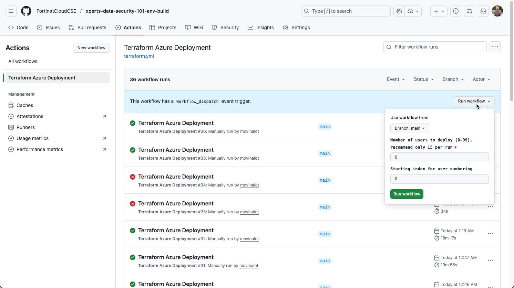

# XPERTS Data Security 101 Environment Build

Data Security 101 - Environment build on Azure

To deploy/destroy "XPERTS Data Security 101" environments in the Azure Fortinet Cloud Training tenant use the Github Workflow "Terraform Azure Deployment".

The workflow utilizes the terraform in this repository to manage Azure user accounts and resources required for the XPERTS Data Security 101 session.

This workflow is run manually and requires two parameters to initiate the deployment/destruction of accounts and resources.

## Execution and Output

### Run Github Workflow

Run Github Workflow [Terraform Azure Deployment - Data Security 101 Env Build](https://github.com/FortinetCloudCSE/xperts-data-security-101-env-build/actions/workflows/terraform.yml)

- Number of Users to deploy
  - A value of zero will destroy any existing users and environments.
  - A value of 1 or greater will deploy/update that number of users and environments

- Starting index for user numbering
  - Any 1 or 2 digit value will deploy users and environments using the provided number as a starting point for indexing
  - For example if
    - Repository variable ENV_USERNAME_PREFIX is set to `dlp`
    - Number of users is set to `4`
    - Starting index for users is set to `8`
    - Created users will be
      - dlp08
      - dlp09
      - dlp10
      - dlp11

### Workflow output

Workflow output is found at the end of the **terraform output** step.

Output consists of the user credentials and bastion host links

## Environment Dependencies

- These environments depend upon OneDrive licenses being assigned to the created Azure user accounts.
- OneDrive licenses are associated to the FortinetCloud Training tenant through a Group Assignment
- Created users are assigned to the Entra ID group xperts-data-security-101-one-drive-users whose Object ID is stored in a repository secret variable
